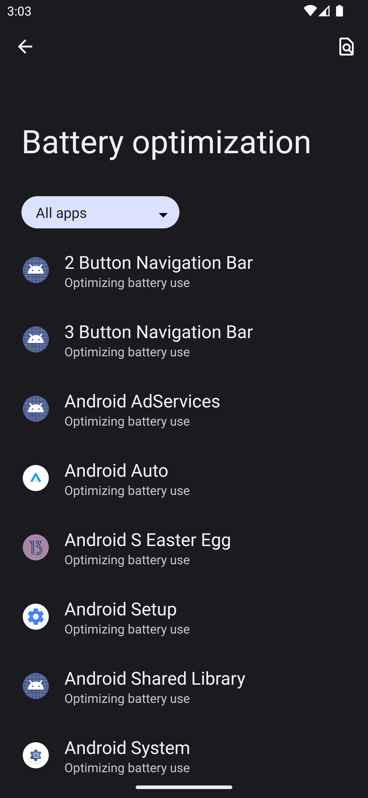

# Switching off Power Optimization Settings for TM Forwarder
When you install TM Forwarder on your phone, Android switches on some power optimization settings for the app by default. These settings might impact the TM Forwarder app functionality as the app needs to be active on the background and the Android OS does not like that!

To switch off the Android Power Optimization Settings for the TM Forwarder app, open the Power Optimization Settings on you phone, open the  TM Forwarder app, Click on the upper left burger menu icon to open the application side menu, click on the  Settings menu item, choose  Power Saving Information settings, and click on the Open Battery Optimization Settings button. It will take you to the Android's Battery Optimization Settings like below:

