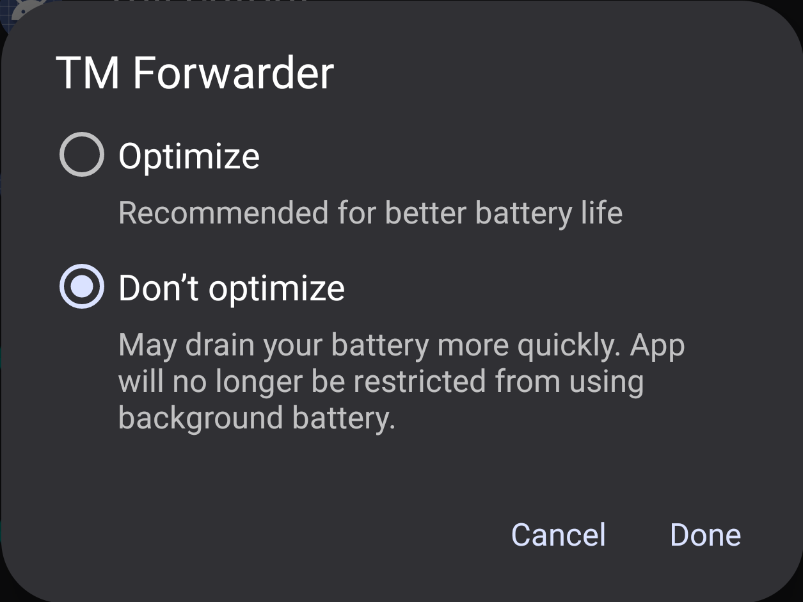

# Switching off Power Optimization Settings for TM Forwarder
When you install TM Forwarder on your phone, Android switches on some power optimization settings for the app by default. These settings might impact the TM Forwarder app functionality as the app needs to be active on the background and the Android OS does not like that!

To switch off the Android Power Optimization Settings for the `TM Forwarder` app, open the Power Optimization Settings on you phone, open the  TM Forwarder app, Click on the upper left burger menu icon to open the application side menu, click on the  Settings menu item, choose  `Power Saving Information` settings, and click on the `Open Battery Optimization Settings` button. It will take you to the Android's `Battery Optimization Settings` like below (It might look slightly different depending on your phone's OS version):

**Note:** Make sure you have selected `All apps` from the top drop-down menu 

Scroll down to find the  TM Forwarder app. Tap on it, select the `Don't optimize` option and click on `Done`

---

Even when whitelisting the  TM Forwarder app in the Battery Optimization Settings, some additional optimization cuts can be applied by the operating system depending your device manufacturer. Check out [dontkillmyapp.com](https://dontkillmyapp.com/) for more details.
You can also find intructions of how to allow the  TM Forwarder app to run in background for most popular Android device manufacturers such as:

- [Samsung](https://dontkillmyapp.com/samsung)
- [AOSP (Android One, Pixel, Nexus)](https://dontkillmyapp.com/google)
- [Xiaomi](https://dontkillmyapp.com/xiaomi)
- [Huawei](https://dontkillmyapp.com/huawei)
- [OnePlus](https://dontkillmyapp.com/oneplus)
- [Oppo](https://dontkillmyapp.com/oppo)
- [Vivo](https://dontkillmyapp.com/vivo)

---

### It's done! Now the TM Forwarder application should work as expected :)